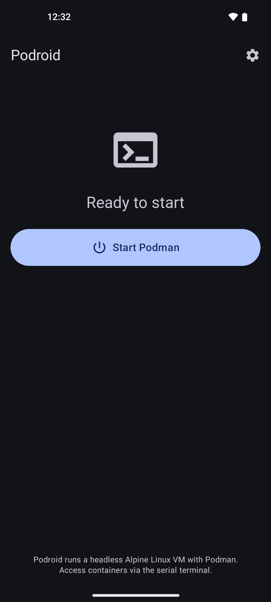
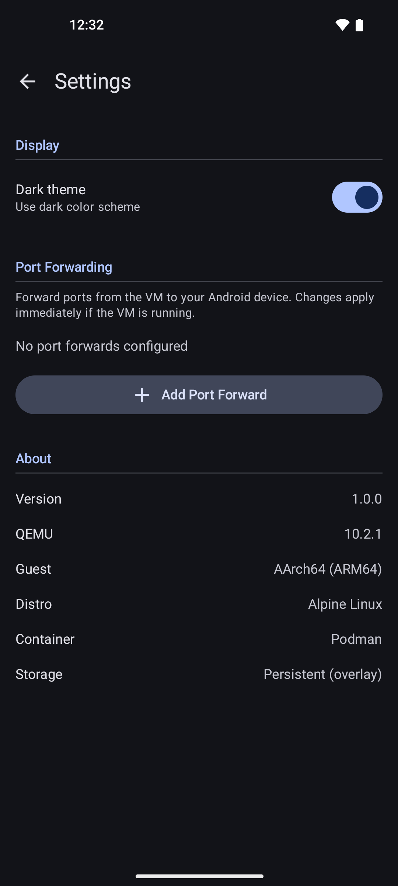
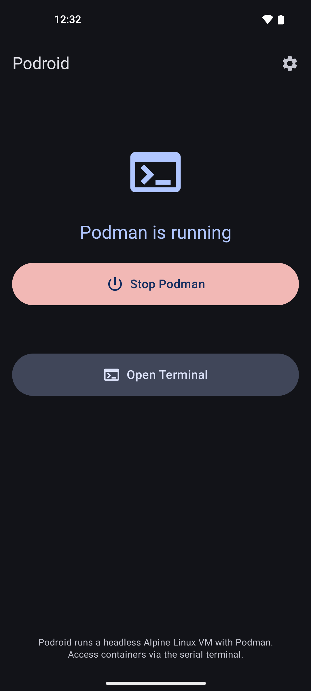
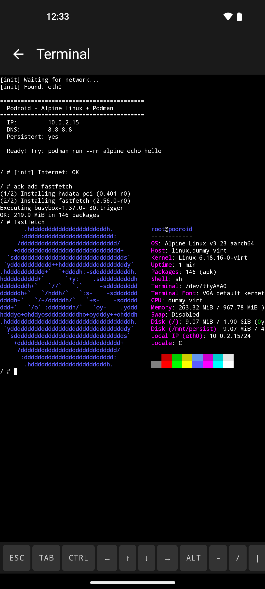

# Podroid — Rootless Podman for Android

Run Linux containers on your Android phone — no root required. Podroid launches a lightweight Alpine Linux VM via QEMU and gives you a fully working **Podman** container runtime with a built-in terminal emulator.

## Features

- **Podman** — pull and run OCI containers (`podman run --rm alpine echo hello`)
- **Alpine Linux 3.23** — minimal aarch64 VM with full networking
- **Termux terminal** — proper VT100/xterm emulation with extra keys (Ctrl, arrows, ESC, TAB)
- **Persistent storage** — 2GB ext4 disk, all VM data survives app restarts via overlayfs
- **Port forwarding** — forward ports from the VM to the Android host, configurable in Settings
- **Internet access** — QEMU user-mode networking (SLIRP), ping/wget/curl all work
- **Job control** — Ctrl+C, Ctrl+Z, Ctrl+D work as expected
- **One-tap start/stop** — clean Material 3 interface
- **No root, no host binaries** — fully self-contained, works on any arm64 Android device

## Screenshots

<p>
  
  
  
  
</p>

## Requirements

- Android device with **arm64** (aarch64) CPU
- Android **14+** (API 34)
- ~200MB storage for the app

## Architecture

```
┌─────────────────────────────────────────────┐
│              Podroid App                     │
│                                             │
│  Home Screen ──► Terminal Screen            │
│      │           (Termux TerminalView)      │
│      │                │                     │
│      ▼                ▼                     │
│  PodroidService    TerminalViewModel        │
│      │             (reflection-based        │
│      ▼              session wiring)         │
│  PodroidQemu                                │
│      │  ├── stdin/stdout (serial I/O)       │
│      │  └── QMP socket (VM management)      │
│      ▼                                      │
│  libqemu-system-aarch64.so                  │
│      │                                      │
│  ┌───▼───────────────────────────────────┐  │
│  │  Alpine Linux VM (overlayfs root)     │  │
│  │  ┌─────────────────────────────────┐  │  │
│  │  │ initramfs (read-only base)      │  │  │
│  │  │ + persistent overlay (ext4 disk)│  │  │
│  │  ├─────────────────────────────────┤  │  │
│  │  │ Podman + crun + netavark        │  │  │
│  │  │ fuse-overlayfs + slirp4netns    │  │  │
│  │  │ getty on ttyAMA0 (job control)  │  │  │
│  │  └─────────────────────────────────┘  │  │
│  └───────────────────────────────────────┘  │
└─────────────────────────────────────────────┘
```

## Project Structure

```
├── Dockerfile                  # Multi-stage initramfs builder
├── docker-build-initramfs.sh   # Build script (produces vmlinuz-virt + initrd.img)
├── init-podroid                # Custom /init for the Alpine VM
├── app/
│   └── src/main/
│       ├── java/com/excp/podroid/
│       │   ├── PodroidApplication.kt   # Asset extraction on startup
│       │   ├── MainActivity.kt         # Single-activity Compose host
│       │   ├── engine/
│       │   │   ├── PodroidQemu.kt      # QEMU lifecycle + serial I/O
│       │   │   ├── QmpClient.kt        # QMP protocol (port forwarding)
│       │   │   └── VmState.kt          # VM state machine
│       │   ├── data/repository/
│       │   │   ├── SettingsRepository.kt      # App preferences
│       │   │   └── PortForwardRepository.kt   # Port forward rules
│       │   ├── service/
│       │   │   └── PodroidService.kt   # Foreground service
│       │   └── ui/screens/
│       │       ├── home/               # Start/Stop + status
│       │       ├── terminal/           # Termux TerminalView + extra keys
│       │       └── settings/           # Port forwarding + app settings
│       ├── jniLibs/arm64-v8a/
│       │   ├── libqemu-system-aarch64.so   # Pre-built QEMU
│       │   └── libslirp.so                 # Network library
│       └── assets/
│           ├── vmlinuz-virt    # Alpine kernel (generated)
│           ├── initrd.img      # Alpine initramfs (generated)
│           └── qemu/           # QEMU firmware files
```

## Building

### 1. Build the initramfs

Requires Docker with multi-arch support (`docker buildx` or `qemu-user-static`):

```bash
./docker-build-initramfs.sh
```

This produces `app/src/main/assets/vmlinuz-virt` and `app/src/main/assets/initrd.img`.

### 2. Build the APK

```bash
./gradlew assembleDebug
```

### 3. Install

```bash
adb install app/build/outputs/apk/debug/app-debug.apk
```

## Usage

1. Open Podroid
2. Tap **Start Podman**
3. Wait for the VM to boot (~20s)
4. Tap **Open Terminal**
5. Run containers:
   ```
   podman run --rm alpine echo hello
   podman run --rm -it alpine sh
   podman run -d -p 8080:80 nginx
   ```

### Port Forwarding

Forward ports from the VM to your Android device:

1. Go to **Settings**
2. Add a port forward rule (e.g. TCP 8080 -> 80)
3. Access the service from your phone at `localhost:8080`

Rules are saved and automatically applied on VM start. You can also add/remove rules while the VM is running via QMP.

### Extra Keys

The terminal includes an extra keys bar with:
- **ESC** / **TAB** — standard terminal keys
- **CTRL** — toggle modifier, then press a key (e.g. CTRL + C to interrupt)
- **Arrow keys** — navigate in shell history and editors
- **ALT** — toggle modifier for alt combinations
- **-** / **/** / **|** — common shell symbols

## How It Works

Podroid uses QEMU system emulation (TCG, no KVM) to run a headless aarch64 Alpine Linux VM inside an Android app process.

### VM Boot

The VM boots from an initramfs containing a full Alpine rootfs. A two-phase init script (`init-podroid`) mounts a persistent ext4 disk and creates an overlayfs root — the initramfs is the read-only lower layer, and all changes (installed packages, container images, config files) are stored on the persistent upper layer.

### Terminal

The terminal uses Termux's `TerminalView` and `TerminalEmulator` libraries for proper VT100/xterm emulation. Since the app cannot use any host binaries, the `TerminalSession` is created and wired to QEMU's serial console I/O via reflection — keyboard input is drained from the session's internal queue and forwarded to QEMU stdin, while QEMU stdout feeds the terminal emulator.

A `getty` process runs on `/dev/ttyAMA0` inside the VM, providing a real controlling TTY with job control so signals like Ctrl+C work correctly.

### Networking

QEMU's user-mode networking (SLIRP) provides internet access with the VM at `10.0.2.15`. Port forwarding uses QEMU's `hostfwd` mechanism, managed at startup via command-line args and at runtime via QMP (`human-monitor-command`).

### Key QEMU Flags

```
-M virt -cpu max -m 1024 -accel tcg,thread=multi
-kernel vmlinuz-virt -initrd initrd.img
-append "console=ttyAMA0 loglevel=1 quiet"
-device virtio-blk-pci,drive=drive1 -drive file=storage.img,...
-netdev user,id=net0,hostfwd=... -device virtio-net,netdev=net0
-serial stdio -display none
-qmp unix:qmp.sock,server,nowait
```

## Credits

- [QEMU](https://www.qemu.org) — machine emulation
- [Alpine Linux](https://alpinelinux.org) — lightweight VM base
- [Podman](https://podman.io) — container runtime
- [Termux](https://github.com/termux/termux-app) — terminal emulator and terminal view libraries
- [Limbo PC Emulator](https://github.com/limboemu/limbo) — pioneered QEMU on Android

## License

GNU General Public License v2.0
